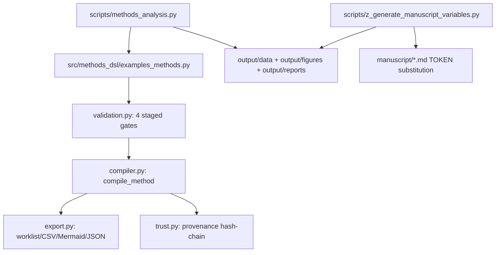

# A Domain Language for Specifying Controlled Methods — Methods Paper Exemplar

A methods-paper exemplar: the manuscript's subject is the methodology itself
— a small, tested domain language for specifying, validating, and
deterministically compiling controlled procedures (`src/methods_dsl/`), not
results produced by running one. Exemplar roster:
[`projects/AGENTS.md`](../../AGENTS.md#permanent-canonical-exemplars).

## When to use this template

Use this template when the paper you are writing **describes a methodology**
rather than reports results: a procedure, protocol, or specification
language, where the contribution is the controlled vocabulary and its
guarantees (dimensional safety, staged validation, deterministic
compilation) rather than a numeric outcome. The domain language's
vocabulary is informed by [BPL (Biology Programming
Language)](https://gitlab.com/bota-biosciences-public/bpl-code), an
upstream reference for encoding controlled-system protocols as programs;
this exemplar generalizes BPL's intent vocabulary and staged-pipeline shape
from wet-lab protocols to any controlled procedure — demonstrated on a
manual wet-lab preparation (`PBSPreparation`) and an automated
instrument-calibration sweep (`SensorCalibrationSweep`). If your project
reports numerical results from running an algorithm, see
[`template_code_project`](../template_code_project/) instead.

## Quick Start — run via the template monorepo

```bash
# Run the methods analysis pipeline (compiles, validates, exports artifacts + a figure)
uv run python projects/templates/template_methods_paper/scripts/methods_analysis.py

# View outputs
ls -la projects/templates/template_methods_paper/output/figures/
cat projects/templates/template_methods_paper/output/data/compiled_plans.json
```

To regenerate this exemplar from the public monorepo:

```bash
git clone https://github.com/docxology/template
cd template
uv sync
uv run python scripts/runner/execute_pipeline.py --project templates/template_methods_paper --core-only
uv run python scripts/pipeline/stage_04_validate.py --project templates/template_methods_paper
uv run python scripts/pipeline/stage_05_copy.py --project templates/template_methods_paper
```

## Tests, outputs, and validation

**Test/coverage gate (authoritative per-project command).** Exit code 0 alone
is not proof — confirm tests collected > 0 and coverage ≥ 90%:

```bash
uv run pytest projects/templates/template_methods_paper/tests \
  --cov=projects/templates/template_methods_paper/src --cov-fail-under=90
# live baseline: docs/_generated/COUNTS.md
```

**Outputs and validation.** `scripts/methods_analysis.py` writes disposable
artifacts under [`output/`](output/) (worklist/CSV/Mermaid/JSON exports per
example method, a step-count figure, and gate/trust-chain reports) and
prints each path for manifest collection. Validate a run with stage 04:

```bash
uv run python scripts/pipeline/stage_04_validate.py --project templates/template_methods_paper
```

## Configuration

`manuscript/config.yaml` is the configuration source of truth (paper
metadata, publication block, and the `dsl` block documenting the example
methods and staged gates); copy
[`manuscript/config.yaml.example`](manuscript/config.yaml.example) to start a
new project. The controlled vocabulary itself is declared in code
(`src/methods_dsl/vocabulary.py`, `units.py`), not configuration. No absolute
paths are hardcoded anywhere.

## Key features

- **Controlled-method model** (`src/methods_dsl/model.py`): `Method`,
  `Step`, `Resource`, `Parameter` as frozen dataclasses — constructed
  directly in Python rather than parsed from new text syntax.
- **Dimensional safety** (`units.py`): every `Quantity` resolves to one of
  eight dimensions (seven physical, including separate molar- and
  mass-concentration dimensions, plus dimensionless); incompatible-unit
  arithmetic raises `DimensionError`.
- **Four staged validation gates** (`validation.py`): structural, semantic,
  plan (DAG), and target compatibility — `run_all_gates` runs them in a
  fixed, short-circuiting order.
- **Deterministic compiler** (`compiler.py`): Kahn's-algorithm topological
  scheduling with an ascending-step-id tie-break, hashed with SHA-256 —
  the same `Method` always compiles to the same `Plan.plan_hash`.
- **Exporters** (`export.py`): worklist markdown, CSV, Mermaid graph,
  canonical JSON.
- **Provenance hash-chain** (`trust.py`): Declared/Calibrated/Verified
  tiers over a hash-chained state history (a consistency check, not a
  cryptographic tamper-proofing guarantee — see `docs/architecture.md`).
- **Thin analysis script**: `scripts/methods_analysis.py` compiles both
  worked examples, runs every gate, and writes all export/report artifacts
  headless.

## Architecture



## Publication and rendering

<!-- PUBLISHING-STATUS:START (generated by infrastructure.publishing.status_report) -->
**A Domain Language for Specifying Controlled Methods** · v1.0.0 · MIT · Daniel Ari Friedman

Concept DOI: [10.5281/zenodo.21086548](https://doi.org/10.5281/zenodo.21086548) | Version DOI: [10.5281/zenodo.21086549](https://zenodo.org/records/21086549) | Repository: [docxology/template_methods_paper](https://github.com/docxology/template_methods_paper)

Publishing surface — 20 platforms, 9 published:

| Platform | Tier | Status | Reference | Credentials |
| --- | --- | --- | --- | --- |
| zenodo | first-class | ✅ published | [10.5281/zenodo.21086548](https://doi.org/10.5281/zenodo.21086548) | `ZENODO_API_TOKEN` |
| github | first-class | ✅ published | [docxology/template_methods_paper](https://github.com/docxology/template_methods_paper) | `GITHUB_TOKEN` |
| arxiv | first-class | ⚪ available | — | — |
| pypi | first-class | ✅ published | [https://test.pypi.org/project/template-methods-paper/1.0.0/](https://test.pypi.org/project/template-methods-paper/1.0.0/) | `PYPI_TOKEN`, `TESTPYPI_TOKEN` |
| ipfs_pinata | first-class | ✅ published | [https://gateway.pinata.cloud/ipfs/Qmc9puHs6KiEnCraVgWUXVxcyAZyT7nt9EMXXLBhy2bAou](https://gateway.pinata.cloud/ipfs/Qmc9puHs6KiEnCraVgWUXVxcyAZyT7nt9EMXXLBhy2bAou) | `PINATA_JWT` |
| ipfs_web3storage | first-class | ⚪ available | — | `WEB3_STORAGE_TOKEN` |
| software_heritage | first-class | ✅ published | [https://archive.softwareheritage.org/browse/origin/?origin_url=https://github.com/docxology/template_methods_paper](https://archive.softwareheritage.org/browse/origin/?origin_url=https://github.com/docxology/template_methods_paper) | — |
| github_pages | first-class | ✅ published | [https://docxology.github.io/template_methods_paper/](https://docxology.github.io/template_methods_paper/) | `GITHUB_TOKEN` |
| cloudflare_pages | first-class | ⚪ available | — | `CLOUDFLARE_API_TOKEN` |
| netlify | first-class | ✅ published | [https://6a444b88aa6e4e3c5d216e16--tranquil-kleicha-0c9203.netlify.app](https://6a444b88aa6e4e3c5d216e16--tranquil-kleicha-0c9203.netlify.app) | `NETLIFY_AUTH_TOKEN` |
| huggingface_hub | first-class | ✅ published | [https://huggingface.co/datasets/ActiveInference/template_methods_paper](https://huggingface.co/datasets/ActiveInference/template_methods_paper) | `HUGGINGFACE_TOKEN`, `HF_TOKEN` |
| osf | first-class | ✅ published | [https://osf.io/6d7nh/](https://osf.io/6d7nh/) | `OSF_TOKEN` |
| amazon_kdp | documented | 🟡 planned | — | `AMAZON_KDP_EMAIL`, `AMAZON_KDP_PASSWORD` |
| google_play_books | documented | 🟡 planned | — | `GOOGLE_PLAY_BOOKS_SERVICE_ACCOUNT_JSON` |
| gumroad | documented | 🟡 planned | — | `GUMROAD_ACCESS_TOKEN` |
| leanpub | documented | 🟡 planned | — | `LEANPUB_API_KEY` |
| lulu | documented | 🟡 planned | — | `LULU_CLIENT_KEY`, `LULU_CLIENT_SECRET` |
| draft2digital | documented | 🟡 planned | — | `DRAFT2DIGITAL_API_TOKEN` |
| stripe | documented | 🟡 planned | — | `STRIPE_SECRET_KEY`, `STRIPE_PUBLISHABLE_KEY` |
| ingramspark | documented | 🟡 planned | — | `INGRAMSPARK_CLIENT_ID`, `INGRAMSPARK_CLIENT_SECRET` |

_Keywords: methods paper, domain-specific language, controlled methods, deterministic compilation, staged validation, dimensional analysis._

_Status legend: ✅ published (durable identifier recorded in `config.yaml`) · 🔵 reserved (identifier reserved but not yet registered by final publication) · ⚪ available (adapter implemented and locally verifiable) · 🟡 planned. This block is generated — edit `manuscript/config.yaml`, then regenerate with `uv run python -m infrastructure.publishing.status_report --project <path> --write`._
<!-- PUBLISHING-STATUS:END -->

The 3 platforms still shown ⚪ available are not automatable to "published" with
current tooling/credentials, not an oversight: **arXiv** has no submission API
in this codebase (`infrastructure.publishing.arxiv` only prepares a local
tarball — a human must upload it via arxiv.org and the resulting `arxiv` URL
would then be added to `publication.published_artifacts`); **Cloudflare
Pages** needs a `CLOUDFLARE_ACCOUNT_ID` the configured API token cannot
auto-discover; **IPFS (Web3.Storage)** has no `WEB3_STORAGE_TOKEN` configured.

- `src/methods_dsl/` is standalone except one sanctioned exception
  (`_logging.py`), declared in
  [`manuscript/layer_contract.yaml`](manuscript/layer_contract.yaml) and
  enforced by the `src_infrastructure_import` drift check.

## Research overlays

- [`domain_profile.yaml`](domain_profile.yaml) — the `methods_dsl` domain,
  outputs, review gates, source policy, and artifact expectations.
- [`experiment_plan.yaml`](experiment_plan.yaml) — the worked-example
  conditions, primary metric, expected figures and tables.
- [`data/claim_ledger.yaml`](data/claim_ledger.yaml) — manuscript numeric
  claims sourced from code/artifacts.

These files are validation inputs only; they do not run autonomous agents.

## More information

See [AGENTS.md](AGENTS.md) for technical documentation and
[`src/AGENTS.md`](src/AGENTS.md) / [`src/methods_dsl/AGENTS.md`](src/methods_dsl/AGENTS.md)
for the library API.

## Template integrity (fork / standalone)

- Forward backlog: [`TODO.md`](TODO.md).
- Standalone fork guide: [`STANDALONE.md`](STANDALONE.md).
- Copy-and-customize config: [`manuscript/config.yaml.example`](manuscript/config.yaml.example).
- Project validation: `uv run pytest projects/templates/template_methods_paper/tests --cov=projects/templates/template_methods_paper/src --cov-fail-under=90`.
- Repo drift validation: `uv run python scripts/audit/check_template_drift.py --strict`.
