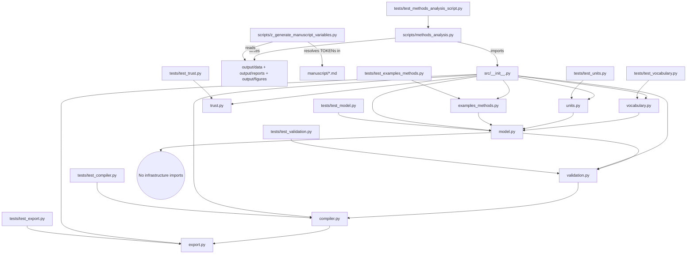

# Architecture: The Thin Orchestrator Flow

The `template_methods_paper` exemplar is designed around a strict separation
of concerns: the controlled-method DSL *logic* lives in a tested library, and
the scripts that drive it are thin callers. Understanding this before
modifying any file prevents the most common errors — validation or
compilation logic hiding inside a script, reusable logic trapped outside
`src/methods_dsl/`, and mocks appearing in tests.

## Layer Reference

| Layer | Primary Files | Public API | Invariants | Testability |
|---|---|---|---|---|
| **`src/methods_dsl/` — DSL Library** | `vocabulary.py`, `units.py`, `model.py`, `validation.py`, `compiler.py`, `export.py`, `trust.py`, `examples_methods.py` | Re-exported from `src/__init__.py` (`compile_method`, `run_all_gates`, …) | Pure dataclasses and functions; no plotting, no file I/O, no `infrastructure.*` imports except the one declared exception in `_logging.py` | Direct unit tests against real `Method` fixtures |
| **`scripts/` — Orchestrators** | `scripts/methods_analysis.py`, `scripts/z_generate_manuscript_variables.py` | `run_methods_analysis()` + `main()` | All matplotlib + file writes + manuscript-variable generation live here; no DSL logic | `test_methods_analysis_script.py` runs it against a temp root |
| **`infrastructure/` — Cross-Cutting** | `infrastructure/rendering/`, `infrastructure/core/`, `infrastructure/validation/` | PDF rendering, logging, output validation | Generic reusable behavior only | Covered by the separate `tests/infra_tests/` suite |

## Pipeline-stage correspondence (BPL-inspired)

Each module corresponds to one stage of a BPL-style compiler pipeline
(parse → semantic check → lower → schedule → execute → export); see
`manuscript/02_methodology.md` for the full per-module mapping.

| Pipeline stage | This DSL's module |
|---|---|
| Syntax / construction | `model.py` (`__post_init__` validators) |
| Semantic check | `validation.py::semantic_gate` |
| Plan / scheduling | `validation.py::plan_gate` + `compiler.py::topological_order` |
| Backend preflight | `validation.py::target_gate` |
| Compile | `compiler.py::compile_method` |
| Export | `export.py` |
| Audit | `trust.py` |

## Strict Dependency Direction

```
scripts/   ──→ src/      (methods_analysis.py calls the library, then exports/plots)
src/methods_dsl/ ──→ [stdlib only, + one declared infrastructure.core.logging exception]
tests/     ──→ src/, scripts/  (direct testing of real behavior)
```

No arrows go upward. The DSL library never imports `infrastructure.*` (with
the one declared `_logging.py` exception) or any sibling project, so it
stays forkable.



## Forbidden Patterns

| Pattern | Why It Is Forbidden | Correct Alternative |
|---|---|---|
| Gate or scheduling logic inside `scripts/` | Cannot be unit-tested at the same granularity; drifts from the library | Move to `src/methods_dsl/validation.py` or `compiler.py`, add a test, call it from the script |
| `import matplotlib` inside `src/methods_dsl/` | Breaks library purity; needs a display backend | Return text/JSON from exporters; plot in `scripts/` |
| `from infrastructure import ...` anywhere except `_logging.py` | Breaks the standalone/forkable contract | Keep the library standalone; the one sanctioned exception is declared in `manuscript/layer_contract.yaml` |
| Reordering or skipping a staged gate | Breaks the BPL-inspired staged short-circuit; later gates assume earlier ones passed | Always run gates via `run_all_gates`, never call `plan_gate`/`target_gate` standalone in product code |
| Hardcoding a `plan_hash` literal in a test | Silently stops testing the moment the compiler's hash input changes | Compile the same method twice and assert hash equality live |
| Hardcoded absolute paths | Makes copied projects brittle | Resolve paths relative to the project root via `project_paths.py` |
| `unittest.mock`, `MagicMock`, `@patch` in `tests/` | Zero-mock policy | Construct real `Method` fixtures and call the real function |

## How to Add a New Method (or DSL Capability)

Follow these steps in order:

1. **Construct the `Method`** in `src/methods_dsl/examples_methods.py` (or a
   new module) using `model.py`'s dataclasses — type hints, no plotting, no
   file I/O.
2. **Write a test** in the matching `tests/test_*.py` — zero-mock; assert
   that `run_all_gates` passes and `compile_method` produces the expected
   step count and a stable hash; run
   `uv run pytest projects/templates/template_methods_paper/tests --cov=projects/templates/template_methods_paper/src --cov-fail-under=90`.
3. **Wire it into `scripts/methods_analysis.py`** if it should appear in the
   compiled-plan report — the script exports its plan and adds it to
   `output/data/compiled_plans.json`.
4. **Update the manuscript** — describe it in `manuscript/05_experimental_setup.md`
   and reference its compiled-plan row in `manuscript/03_results.md` using
   concrete paths (e.g. `src/methods_dsl/compiler.py::compile_method()`).
