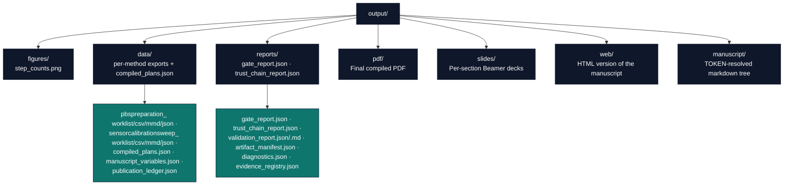

# Output Directory Conventions

The project-relative `output/` directory
(`projects/templates/template_methods_paper/output/`) holds all generated
artifacts from the analysis pipeline. This document describes its structure,
regeneration process, and version-control policy.

## Directory Purpose

`output/` is **disposable but regeneratable**. Every file is produced by a
deterministic pipeline step; none should be edited manually. If a file is
missing or corrupted, re-run the appropriate step to recreate it.

**Key principle:** the source of truth for all outputs is the combination of:
- `src/methods_dsl/examples_methods.py` (the worked example methods)
- `src/methods_dsl/*.py` (model, validation, compilation, export, trust logic)
- `scripts/methods_analysis.py` (orchestration: gates + compile + export + plot)
- `scripts/z_generate_manuscript_variables.py` (token generation + injection)
- `manuscript/config.yaml` (paper/publication metadata)

## Directory Structure



## Regeneration Sequence

1. **Clean (optional)**: delete the entire `output/` directory to start
   fresh.
   ```bash
   rm -rf projects/templates/template_methods_paper/output/
   ```

2. **Run the analysis** — compiles both example methods, runs every staged
   gate, exports per-method worklist/CSV/Mermaid/JSON, demonstrates the
   trust hash-chain, and plots the step-count figure.
   ```bash
   uv run python projects/templates/template_methods_paper/scripts/methods_analysis.py
   ```
   **Outputs**: `data/`, `reports/`, `figures/`

3. **Generate manuscript variables** — resolves every `{{TOKEN}}`.
   ```bash
   uv run python projects/templates/template_methods_paper/scripts/z_generate_manuscript_variables.py
   ```
   **Outputs**: `data/manuscript_variables.json`, `manuscript/` (resolved tree)

4. **Render PDF** — converts the manuscript to PDF via Pandoc/LaTeX (and, when
   `render.formats.slides: true` in `manuscript/config.yaml`, per-section
   Beamer decks).
   ```bash
   uv run python scripts/pipeline/stage_03_render.py --project templates/template_methods_paper
   ```
   **Outputs**: `pdf/`, `slides/`, `web/`

5. **Copy final deliverables** — copies PDF and figures to the repo-level
   output tree (used by CI).
   ```bash
   uv run python scripts/pipeline/stage_05_copy.py --project templates/template_methods_paper
   ```

## Version-Control Policy

- **Do not edit files in `output/` manually** — changes are overwritten on
  the next pipeline run.
- **When adding a new output file** (e.g. a new export or report):
  1. Document it in [`output_inventory.md`](output_inventory.md) with its
     producer and stage.
  2. Write it from `scripts/methods_analysis.py`, sourcing the content from
     a tested `src/methods_dsl/` function.
  3. Reference it from the manuscript with a `{{TOKEN}}` or a `{#fig:label}`.

## Troubleshooting

- **Missing file**: re-run the analysis step.
- **Stale file**: delete `output/` and run the full sequence above.
- **Figure not appearing in PDF**: verify the PNG exists in
  `output/figures/` and that `03_results.md` references it with the correct
  relative path (`../output/figures/step_counts.png`).

## See Also

- [`manuscript/AGENTS.md`](../manuscript/AGENTS.md) — Manuscript modification protocol and token/figure protocol.
- [`rendering_pipeline.md`](rendering_pipeline.md) — Full pipeline description.
- [`syntax_guide.md`](syntax_guide.md) — Token and figure references.
- [`output_inventory.md`](output_inventory.md) — Producer/stage table.
