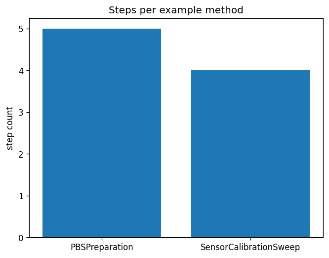

# Troubleshooting

Symptom-driven recipes for the most common breakage modes when running this
project.

## Edited `src/methods_dsl/examples_methods.py` or `manuscript/config.yaml` but the figure/PDF didn't change

**Cause.** The analysis stage was skipped, or only the render stage ran (it
does not re-execute `methods_analysis.py`).

**Fix.** Run analysis, then resolve tokens, then render:

```bash
uv run python projects/templates/template_methods_paper/scripts/methods_analysis.py
uv run python projects/templates/template_methods_paper/scripts/z_generate_manuscript_variables.py
uv run python scripts/pipeline/stage_03_render.py --project templates/template_methods_paper
```

Or re-run the full pipeline:

```bash
uv run python scripts/runner/execute_pipeline.py --project templates/template_methods_paper --core-only
```

## `MethodValidationError: method '...' failed validation`

**Cause.** One of the four staged gates (structural, semantic, plan, target)
rejected the method — the error message names which gate(s) and why.

**Fix.**

1. Read the gate names and issues in the exception message.
2. Cross-reference against `src/methods_dsl/validation.py`'s gate
   definitions and `manuscript/02_methodology.md`'s description of each gate.
3. Fix the `Method` construction (e.g. a duplicate `step_id`, an unknown unit
   string, a cyclic `depends_on`, or a target/kind mismatch) — never catch
   and suppress `MethodValidationError` to force a green run.

## Unresolved `{{TOKEN}}` after running `z_generate_manuscript_variables.py`

**Symptom.**

```
Unresolved {{TOKEN}} in 03_results.md: SOME_NAME
```

**Cause.** A manuscript file references a `{{TOKEN}}` that
`src/manuscript_variables.py::generate_variables` does not emit — either a
typo in the token name, or a literal generic placeholder mention (e.g.
writing the word `TOKEN` inside double braces as illustrative prose).

**Fix.**

1. Check `manuscript/SYNTAX.md`'s token table for the exact spelling.
2. If the token should exist, add it to `generate_variables()` and a test in
   `tests/test_manuscript_variables.py`.
3. If you were describing the mechanism generically, rephrase without double
   curly braces (see [`faq.md`](faq.md)).

## `Figure ???` in the rendered PDF

**Cause.** The Pandoc-crossref `[@fig:label]` reference does not match any
`{#fig:label}` anchor, or the figure was not generated before compilation.

**Fix.**

1. Verify `manuscript/03_results.md` contains the image with the correct
   anchor:
   ```markdown
   {#fig:step_counts}
   ```
2. Verify the prose reference uses the same label: `See [@fig:step_counts].`
3. Re-run the analysis, token-generation, and render stages.

## Analysis script aborts with a Python error

**Fix.**

1. Re-run with the full traceback visible:
   ```bash
   uv run python projects/templates/template_methods_paper/scripts/methods_analysis.py 2>&1 | tee /tmp/analysis.log
   ```
2. Check the output directory exists and is writable.
3. Validate `manuscript/config.yaml`:
   ```bash
   uv run python -c "import yaml; yaml.safe_load(open('projects/templates/template_methods_paper/manuscript/config.yaml'))"
   ```

## `output/figures/` is empty after running the script

**Cause.** The script set the matplotlib backend after importing pyplot, or
it errored before saving.

**Fix.** Ensure `os.environ.setdefault("MPLBACKEND", "Agg")` runs **before**
the first `import matplotlib.pyplot`, and run with `uv run` from the
repository root.

## `uv` command not found

**Fix.** Install `uv` via the canonical installer (the repo invariant — see
root `CLAUDE.md` — is `uv`-only; never bootstrap `uv` through `pip`):

```bash
curl -LsSf https://astral.sh/uv/install.sh | sh
# or: brew install uv
```

## Coverage gate fails (under 90%)

**Fix.**

1. Find which lines are uncovered:
   ```bash
   uv run pytest projects/templates/template_methods_paper/tests \
       --cov=projects/templates/template_methods_paper/src --cov-report=term-missing -v
   ```
2. Add tests covering the missing branches.
3. Re-run until coverage ≥ 90% and all tests pass.

## PDF Rendering fails: `mmdc` could not find Chrome

**Symptom:** the pipeline reaches **PDF Rendering** and fails even though
tests, analysis, and per-section slide PDFs passed, with an error like:

```
mmdc failed for inline_mermaid_0001_...: Could not find Chrome (ver. ...).
```

**Cause:** a section (or doc diagram) embeds a ```mermaid``` block; the
combined-PDF render shells out to `mmdc`, which needs a pinned
`chrome-headless-shell` in the Puppeteer cache. Slide PDFs do not invoke
`mmdc`, so they still succeed — that asymmetry is the tell.

**Fix:**

```bash
npx --yes puppeteer browsers install chrome-headless-shell
uv run python scripts/pipeline/stage_03_render.py --project templates/template_methods_paper
```

CI provisions it; a fresh clone does not. See
[rendering_pipeline.md](rendering_pipeline.md#prerequisite-mermaid-diagrams-need-chrome-headless-shell).

## Tests report PASSED but ran 0 tests / 0.0% coverage

**Symptom:** the aggregate runner prints `✓ PASSED (0/0 tests, 0.0% coverage)`
and exits 0.

**Cause:** the runner resolved an interpreter from a `.venv` made by `uv venv`
without `uv sync`, so `pytest` is absent and collects nothing. **A green exit
with zero collected tests is not a pass.**

**Fix.** Run the canonical per-project gate directly and confirm collected >
0 AND coverage ≥ 90%:

```bash
uv run pytest projects/templates/template_methods_paper/tests \
  --cov=projects/templates/template_methods_paper/src --cov-fail-under=90
```

## YAML parse error in `manuscript/config.yaml`

**Common mistakes:** tabs instead of spaces, trailing commas, unclosed
quotes.

**Fix.** Validate before running:

```bash
uv run python -c "import yaml; yaml.safe_load(open('projects/templates/template_methods_paper/manuscript/config.yaml'))"
```

## See also

- [`output_conventions.md`](output_conventions.md) — output directory layout and regeneration rules.
- [`rendering_pipeline.md`](rendering_pipeline.md) — the pipeline phases and config controls.
- [`syntax_guide.md`](syntax_guide.md) — manuscript cross-reference + token syntax.
- [`quickstart.md`](quickstart.md) — basic run commands.
- [`faq.md`](faq.md) — frequently asked questions.
