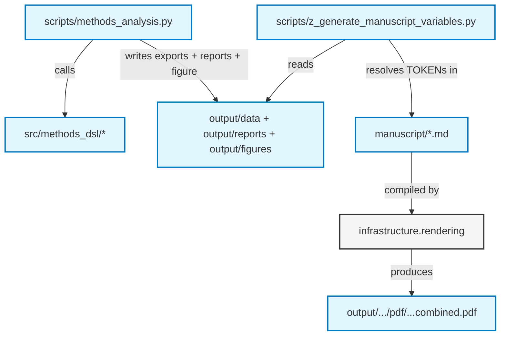

# `template_methods_paper` — Manuscript

The manuscript for the methods-specification-DSL exemplar. It describes a
controlled-method specification language in prose and references the
compiled-plan table and figure produced by the thin analysis script — every
numeric claim is a `{{TOKEN}}` traceable to a tested function in
`src/methods_dsl/`.

## Manuscript Structure

The `manuscript/` directory contains the raw markdown the renderer
(`infrastructure/rendering/pdf_renderer.py`) transforms into the final PDF:

- `00_abstract.md`: Abstract — the DSL's design and the headline numbers.
- `01_introduction.md`: Why a methods paper needs its own DSL; what generalizes from BPL.
- `02_methodology.md`: Vocabulary, units, model, staged gates, compiler, export, trust.
- `03_results.md`: The compiled-plan table and step-count figure.
- `04_conclusion.md`: What the DSL guarantees.
- `05_experimental_setup.md`: Controlled vocabulary, worked examples, environment, reproduction commands.
- `06_reproducibility.md`: Artifact inventory and regeneration commands.
- `07_scope_and_related_work.md`: Scope limits and positioning against BPL.

## Architecture



## Quick Start

```bash
# From repository root
uv run python projects/templates/template_methods_paper/scripts/methods_analysis.py
uv run python projects/templates/template_methods_paper/scripts/z_generate_manuscript_variables.py
uv run python scripts/03_render_pdf.py --project templates/template_methods_paper
```

## AI Agent Directives

If you are an AI agent operating in this repository, read [`AGENTS.md`](AGENTS.md)
before editing — it defines the zero-mock testing constraints and the
token/figure protocol.

## See also

- [`SYNTAX.md`](SYNTAX.md) — Pandoc citation / `{{TOKEN}}` / cross-reference conventions.
- [`../../../docs/guides/manuscript-semantics.md`](../../../../docs/guides/manuscript-semantics.md) — Repository-wide manuscript semantics.
- [`../../../AGENTS.md`](../../../AGENTS.md#permanent-canonical-exemplars) — public exemplar roster.
