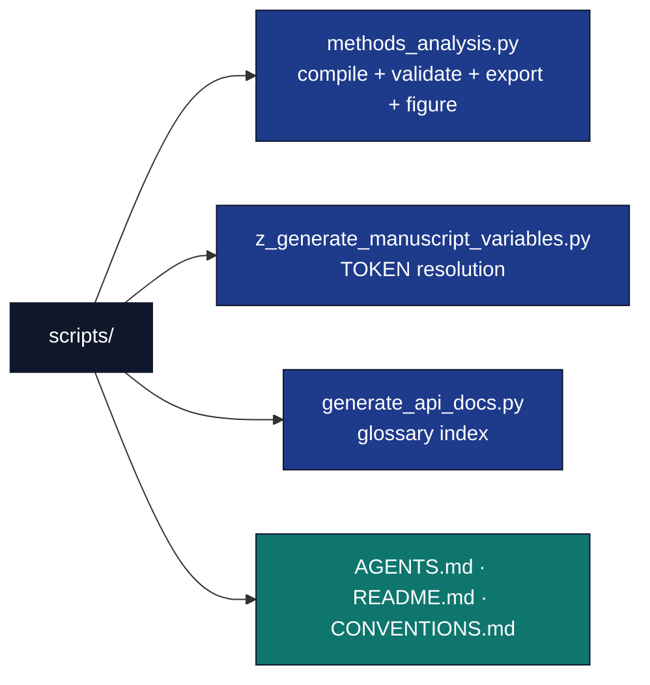

# scripts/ — Analysis Scripts

## Overview

The `scripts/` directory contains **thin orchestrators**. A thin orchestrator
strictly coordinates without implementing DSL logic: all method construction,
validation, compilation, and export computation lives in the tested
`src/methods_dsl/` library. Scripts import from `src/`, call the tested
functions, plot one figure with matplotlib, write artifacts to `output/`, and
resolve manuscript `{{TOKEN}}` values.

## Key Concepts

- **Thin orchestrator pattern**: scripts are glue. They call
  `run_all_gates`/`compile_method`/the exporters and write their output; they
  never construct validation logic or compilation logic themselves.
- **Headless plotting**: `methods_analysis.py` sets `MPLBACKEND=Agg` before
  importing pyplot so it runs on CI and servers without a display.
- **Manifest output**: every written path is printed to stdout for collection.

## Directory Structure



## Usage

```bash
# From the monorepo root
uv run python projects/templates/template_methods_paper/scripts/methods_analysis.py
uv run python projects/templates/template_methods_paper/scripts/z_generate_manuscript_variables.py
```

`methods_analysis.py`:

1. Constructs the two worked example methods (`pbs_preparation_method`,
   `sensor_calibration_method`) via `all_example_methods()`.
2. Runs all four staged validation gates per method (`run_all_gates`) and
   tallies a gate report.
3. Deterministically compiles each validated method to a `Plan`
   (`compile_method`) and exports it as worklist markdown, CSV, Mermaid, and
   canonical JSON.
4. Writes a per-method `compiled_plans.json` summary consumed by
   `src/manuscript_variables.py`.
5. Demonstrates a provenance hash-chain (`append_record`/`verify_chain`)
   across DECLARED → CALIBRATED → VERIFIED tiers and writes a trust-chain
   report.
6. Plots a step-count-per-method bar figure.
7. Prints every output path for manifest collection.

## API Reference

### methods_analysis.py

| Function | Role |
| --- | --- |
| `run_methods_analysis(project_root=None)` | Runs the full pipeline; returns the list of written paths. Accepts an output-root override for tests. |
| `main()` | Calls `run_methods_analysis()` against the real project root and prints each path. |

### z_generate_manuscript_variables.py

| Function | Role |
| --- | --- |
| `main()` | Reads `manuscript/config.yaml` and `output/data`/`output/reports` artifacts via `src.manuscript_variables.generate_variables`, writes `output/data/manuscript_variables.json`, and injects every `{{TOKEN}}` via `infrastructure.rendering.manuscript_injection.write_resolved_manuscript_tree`. `--allow-draft` permits `N/A` fallbacks before `methods_analysis.py` has run. |

All DSL logic is in `src/methods_dsl/`; these scripts only orchestrate. Tested
by [`../tests/test_methods_analysis_script.py`](../tests/test_methods_analysis_script.py),
which runs `run_methods_analysis()` against a temporary output root.

## Configuration

- **Output directories**: resolved via `src/project_paths.py::project_output_dirs`.
- **Plotting backend**: `Agg` (set before importing pyplot).
- **Example methods**: fixed at two (`PBSPreparation`, `SensorCalibrationSweep`)
  via `src/methods_dsl/examples_methods.py::all_example_methods`.

## Best Practices

- Use `pathlib.Path` for all file paths; never hardcode an absolute path.
- Verify generated files exist and have content (the script test asserts this).
- Keep all computation in `src/methods_dsl/` so the script stays trivially thin.

## See Also

- [README.md](README.md) — Quick reference.
- [CONVENTIONS.md](CONVENTIONS.md) — Thin-orchestrator rules and the headless
  plotting pattern.
- [../src/AGENTS.md](../src/AGENTS.md) — Library API the scripts call.
