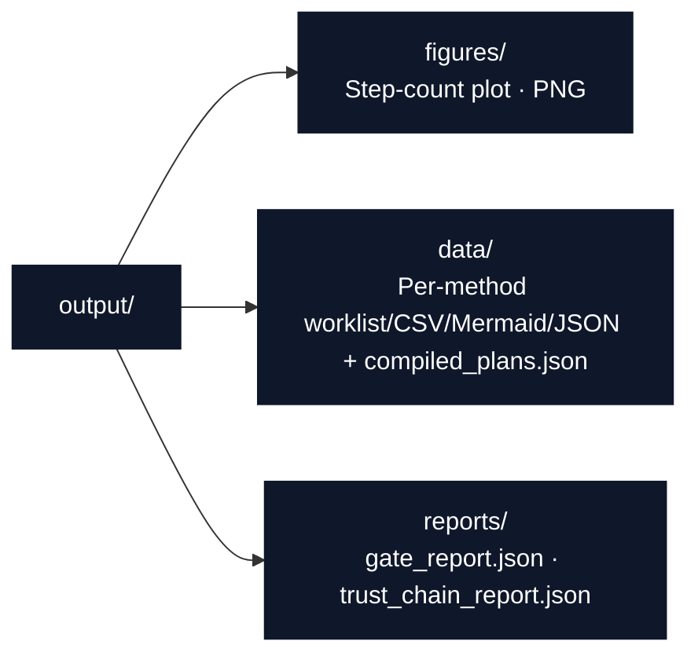

# Script Conventions

Orchestration rules and integration patterns for `scripts/` in the
`template_methods_paper` exemplar.

## Thin Orchestrator Rules

Scripts **coordinate** — they never **compute**:

```python
# ✅ CORRECT: import tested functions, then export/plot/write
from src.methods_dsl import all_example_methods, compile_method, run_all_gates, to_csv_rows

for method in all_example_methods():
    gate_results = run_all_gates(method)
    plan = compile_method(method)
    # ... write to_csv_rows(plan), savefig step counts, print the path
```

```python
# ❌ WRONG: script implements a validation gate directly
def my_target_check(method):
    return all(step.target == method.target for step in method.steps)  # Belongs in src/methods_dsl/validation.py
```

If you find yourself writing model, validation, compilation, or export logic
in `scripts/`, move it to `src/methods_dsl/` first (with a test).

## Headless plotting

Set the Agg backend **before** importing pyplot:

```python
import os
os.environ.setdefault("MPLBACKEND", "Agg")
import matplotlib.pyplot as plt
```

## Import Patterns

```python
import os
import sys
from pathlib import Path

os.environ.setdefault("MPLBACKEND", "Agg")

PROJECT_ROOT = Path(__file__).resolve().parent.parent
for _path in (PROJECT_ROOT, PROJECT_ROOT / "src", PROJECT_ROOT.parents[2]):
    if str(_path) not in sys.path:
        sys.path.insert(0, str(_path))

import matplotlib.pyplot as plt  # noqa: E402
from src.methods_dsl import all_example_methods, compile_method  # noqa: E402
```

- Use explicit imports (not `from module import *`).
- Resolve paths relative to the project root — never hardcode an absolute path.

## Output Directory Structure

Scripts write to the standard output layout via `src/project_paths.py`:



```python
from src.project_paths import project_output_dirs

dirs = project_output_dirs()
dirs["figures"].mkdir(parents=True, exist_ok=True)
dirs["data"].mkdir(parents=True, exist_ok=True)
dirs["reports"].mkdir(parents=True, exist_ok=True)
```

## Manifest Output

Print every written path to stdout so the pipeline can collect it:

```python
for path in run_methods_analysis():
    print(path)
```

## Checklist

Before submitting a new or modified script, verify:

- [ ] All model/validation/compilation/export logic lives in
      `src/methods_dsl/`, not in the script.
- [ ] `MPLBACKEND=Agg` is set before importing pyplot.
- [ ] Output goes to standard `output/` subdirectories via `project_output_dirs`.
- [ ] `Path` objects are used (no string concatenation) for file paths.
- [ ] Every written path is printed for manifest collection.

## See Also

- [AGENTS.md](AGENTS.md) — Script roles and run commands.
- [../src/STYLE.md](../src/STYLE.md) — Style guide for the code scripts import.
- [../docs/architecture.md](../docs/architecture.md) — DSL pipeline-stage flow diagram.
