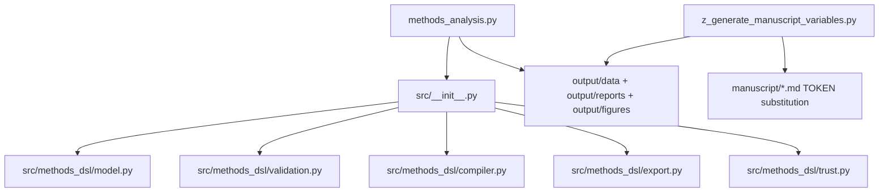

# scripts/ — Analysis Scripts

**Thin orchestrators.** These scripts contain no DSL logic: they import from
`src.methods_dsl`, compile and export the worked example methods, plot one
figure with matplotlib, and write artifacts to `output/`. All compilation,
validation, and export logic lives in the library, never here.

## Quick Start

```bash
# Compile the example methods, run all gates, export artifacts, plot a figure
uv run python scripts/methods_analysis.py

# Generate manuscript {{TOKEN}} values and inject them
uv run python scripts/z_generate_manuscript_variables.py

# View generated outputs
ls -la ../output/data/
cat ../output/reports/gate_report.json
```

## Scripts

| Script | Role | Pipeline |
| --- | --- | --- |
| `methods_analysis.py` | Compiles every example method, runs all validation gates, exports worklist/CSV/Mermaid/JSON per method, demonstrates a provenance hash-chain, and plots a step-count figure | Required |
| `z_generate_manuscript_variables.py` | Reads `methods_analysis.py`'s outputs plus `manuscript/config.yaml` and resolves every `{{TOKEN}}` in `manuscript/*.md` | Required (runs after analysis) |
| `generate_api_docs.py` | Builds a glossary-style API index over `src/` via `infrastructure.documentation.glossary_gen` | Optional |

`run_methods_analysis(project_root=...)` accepts an output-root override so
tests can run it against a temporary directory; `main()` runs it against the
real project root and prints each output path for manifest collection.

## Architecture



## More Information

See [AGENTS.md](AGENTS.md) for technical documentation and
[CONVENTIONS.md](CONVENTIONS.md) for the thin-orchestrator rules.
