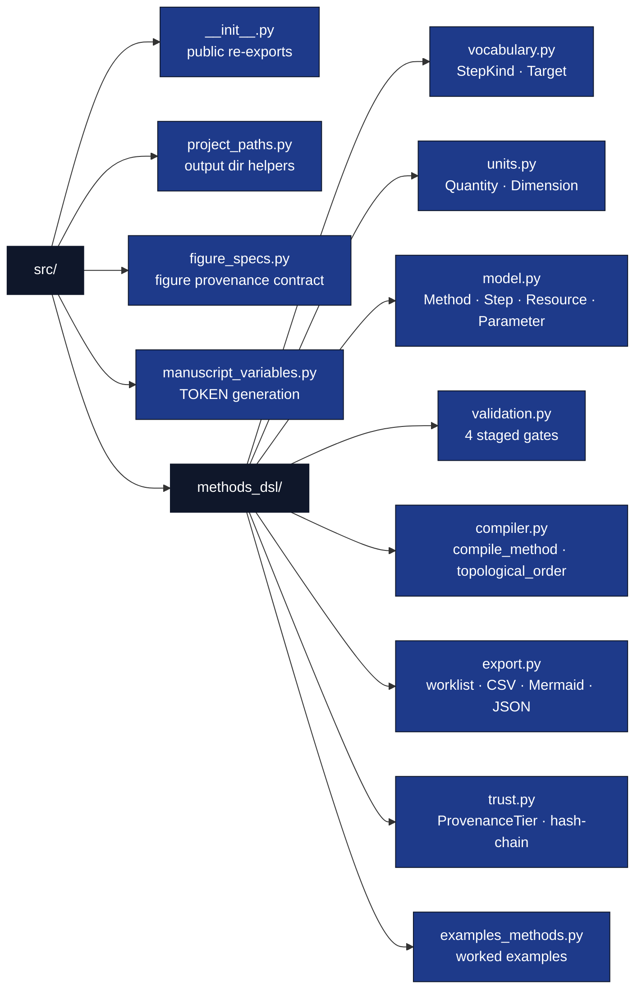

# src/ — Methods Specification DSL

## Overview

The `src/` directory contains the importable, tested controlled-method
specification library for this exemplar. All DSL logic lives in the
`src.methods_dsl` subpackage and is re-exported from `src/__init__.py`, so
callers (scripts, tests, manuscript variable generation) can write
`from src import compile_method, run_all_gates`. The library is
**standalone** except one sanctioned adapter
(`src/methods_dsl/_logging.py`, declared in `manuscript/layer_contract.yaml`):
nothing else imports `infrastructure.*` or any sibling project.

## Key Concepts

- **Controlled vocabulary in code, not a parser**: a `Method` is constructed
  directly as frozen dataclasses (`model.py`) rather than parsed from new
  text syntax — the DSL's discipline is in its typed, validated shape, not in
  a grammar.
- **Staged validation gates**: `structural_gate` → `semantic_gate` →
  `plan_gate` → `target_gate`, run in fixed order by `run_all_gates`
  (`validation.py`), each independently testable.
- **Deterministic compilation**: `compile_method` (`compiler.py`) schedules
  steps with Kahn's algorithm (ties broken by ascending `step_id`) and hashes
  the canonical-JSON plan with SHA-256 — same method always yields the same
  `plan_hash`.
- **Dimensional safety**: every `Quantity` resolves to a `Dimension`
  (`units.py`); incompatible-dimension arithmetic raises `DimensionError`
  instead of silently producing a meaningless number.
- **Zero-mock testability**: every gate, the compiler, and the exporters are
  exercised against real `Method` fixtures (see `tests/conftest.py`) — never
  mocks.

## Directory Structure



## Configuration as Source of Truth

Manuscript and publication metadata are read from `manuscript/config.yaml`
(the configuration single source of truth). The DSL library itself declares
its controlled vocabulary in code (`vocabulary.py`, `units.py`), not in
external configuration — the whole point of a controlled vocabulary is that
it is not re-configurable per run.

## Infrastructure Integration (boundary / contract)

The DSL library is infrastructure-independent by contract, with one declared
exception: `src/methods_dsl/_logging.py` reaches into
`infrastructure.core.logging.utils.get_logger` so gate and compiler log
output matches every other project's structured format, and falls back to
stdlib `logging` if `infrastructure` is not importable (a standalone fork).
The exception is declared in `manuscript/layer_contract.yaml` and enforced by
the `src_infrastructure_import` drift check
(`infrastructure/project/drift/checks_boundary.py`) — every other module here
stays import-clean.

## Usage Examples

```python
from src import (
    all_example_methods, run_all_gates, compile_method,
    to_worklist_markdown, to_csv_rows, to_mermaid,
)

method = all_example_methods()[0]          # PBSPreparation
gates = run_all_gates(method)              # 4 GateResult, all must pass
plan = compile_method(method)              # raises MethodValidationError on a failed gate
print(plan.plan_hash)                      # stable across repeated compilations
print(to_worklist_markdown(plan))          # human-readable numbered steps
```

## Testing

```bash
# From the monorepo root
uv run pytest projects/templates/template_methods_paper/tests \
    --cov=projects/templates/template_methods_paper/src --cov-fail-under=90

# Single function (flat function-style tests — no test classes; see docs/testing_philosophy.md)
uv run pytest projects/templates/template_methods_paper/tests -k "test_run_all_gates"
```

## API Reference

| Module | Public surface |
| --- | --- |
| `methods_dsl/vocabulary.py` | `StepKind`, `Target`, `target_accepts` |
| `methods_dsl/units.py` | `Dimension`, `DimensionError`, `Quantity`, `check_compatible`, `dimension_of`, `known_units` |
| `methods_dsl/model.py` | `Method`, `Step`, `Resource`, `Parameter`, `MethodModelError` |
| `methods_dsl/validation.py` | `GateResult`, `structural_gate`, `semantic_gate`, `plan_gate`, `target_gate`, `run_all_gates` |
| `methods_dsl/compiler.py` | `Plan`, `PlanStep`, `compile_method`, `topological_order`, `MethodValidationError`, `CycleError` |
| `methods_dsl/export.py` | `to_worklist_markdown`, `to_csv_rows`, `write_csv`, `to_mermaid`, `to_json`, `write_json` |
| `methods_dsl/trust.py` | `ProvenanceTier`, `StateRecord`, `append_record`, `verify_chain` |
| `methods_dsl/examples_methods.py` | `pbs_preparation_method`, `sensor_calibration_method`, `all_example_methods` |
| `project_paths.py` | `project_output_dirs`, `resolve_project_root` (orchestration plumbing; not in `__all__`) |
| `figure_specs.py` | `METHODS_FIGURE_SPECS`, `FIGURE_REGISTRY_SCHEMA` (immutable output provenance consumed by `methods_analysis.py`) |
| `manuscript_variables.py` | `generate_variables`, `save_variables` (manuscript-rendering plumbing; not in `__all__`) |

## See Also

- [README.md](README.md) — Quick reference.
- [STYLE.md](STYLE.md) — Code style and the `__all__` export contract.
- [methods_dsl/AGENTS.md](methods_dsl/AGENTS.md) — Subpackage-level rules.
- [../scripts/methods_analysis.py](../scripts/methods_analysis.py) — Example usage (thin orchestrator).
- [../docs/architecture.md](../docs/architecture.md) — Correspondence with BPL's compiler pipeline.
