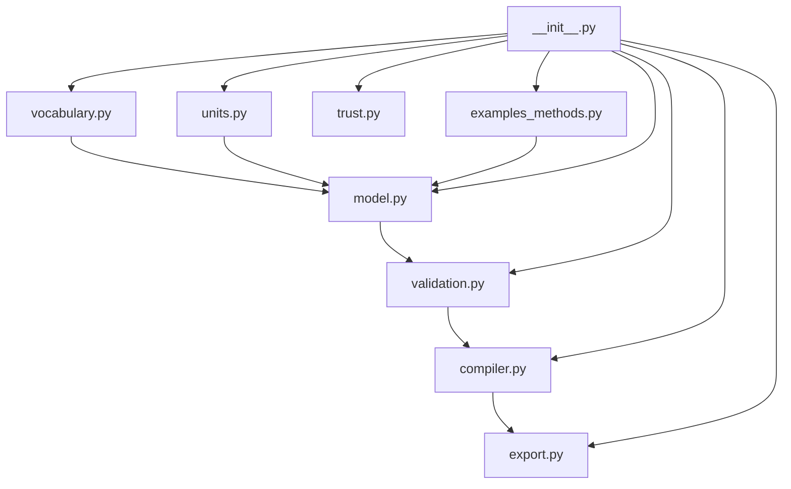

# src/ — Methods Specification DSL

The tested controlled-method specification library for the exemplar. All
logic lives in the `src.methods_dsl` subpackage and is re-exported from
`src/__init__.py`. The library is standalone except one declared logging
adapter (see [AGENTS.md](AGENTS.md)): no plotting, no file I/O in the DSL
itself, no other `infrastructure.*` imports.

## Quick Start

```python
from src import all_example_methods, run_all_gates, compile_method

method = all_example_methods()[0]
assert all(g.passed for g in run_all_gates(method))
plan = compile_method(method)
print(plan.method_name, plan.plan_hash[:12], len(plan.steps))
```

## Key Features

- **Controlled vocabulary** of step intents and execution targets (`vocabulary.py`).
- **Dimensional-safety unit system** — `Quantity` + `Dimension`, no `mL + g` (`units.py`).
- **Method model** — `Method`, `Step`, `Resource`, `Parameter` as frozen dataclasses (`model.py`).
- **Four staged validation gates** run in fixed order (`validation.py`).
- **Deterministic compiler** — `Method` → scheduled, hashed `Plan` (`compiler.py`).
- **Exporters** — worklist markdown, CSV, Mermaid graph, canonical JSON (`export.py`).
- **Provenance hash-chain** with three trust tiers (`trust.py`).
- **Type-safe** with full type hints and reStructuredText-style docstrings.

## Run Tests

```bash
cd projects/templates/template_methods_paper
uv run pytest tests/ --cov=src --cov-fail-under=90
```

## Architecture



## More Information

See [AGENTS.md](AGENTS.md) for the API reference and infrastructure-boundary
contract, and [STYLE.md](STYLE.md) for the code-style and `__all__` export
contract.
